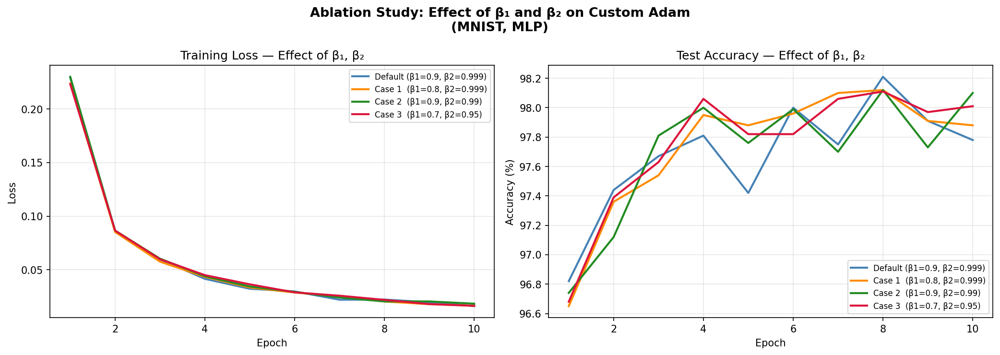

# 🚀 Adam Optimizer — From Scratch Implementation & Empirical Evaluation

Study, Implementation, Theoretical Analysis, and Experimental Comparison

---

## 📌 Overview

This project presents a complete study and implementation of the **Adam Optimizer (Adaptive Moment Estimation)** from scratch using PyTorch tensors.

The repository includes:

* A clean implementation of Adam directly from the original paper
* Theoretical analysis and convergence guarantees
* Empirical comparison with PyTorch’s built-in Adam optimizer
* Hyperparameter ablation studies over `β1` and `β2`
* MNIST experiments with detailed evaluation metrics
* Visualization of training dynamics and optimizer behavior

The project validates that a carefully implemented custom Adam optimizer can closely reproduce the behavior of industrial-grade deep learning frameworks.

---

# 🧠 About Adam Optimizer

Adam combines:

* Momentum-based optimization
* Adaptive learning rates
* Bias correction

into a computationally efficient and memory-friendly optimization algorithm.

For gradient `g_t` at timestep `t`:

## First Moment Estimate

```math
m_t = β_1 m_{t-1} + (1 - β_1) g_t
```

## Second Moment Estimate

```math
v_t = β_2 v_{t-1} + (1 - β_2) g_t^2
```

## Bias-Corrected Estimates

```math
\hat{m}_t = \frac{m_t}{1 - β_1^t}
```

```math
\hat{v}_t = \frac{v_t}{1 - β_2^t}
```

## Parameter Update Rule

```math
θ_t = θ_{t-1} - α \frac{\hat{m}_t}{\sqrt{\hat{v}_t} + ϵ}
```

---

# ✨ Key Features

✅ From-scratch Adam implementation

✅ PyTorch-compatible optimization loop

✅ Bias-corrected moment estimation

✅ Adaptive per-parameter learning rates

✅ MNIST classification experiments

✅ Custom vs. Built-in optimizer comparison

✅ Hyperparameter ablation analysis

✅ Training and evaluation visualizations

---

# 📂 Project Structure

```text
.
├── ablation.py
├── Adam.pdf
├── config.py
├── main.py
├── model.py
├── optimizer.py
├── plots.py
├── Results/
│   ├── comparison_plots.png
│   └── ablation_polts.png
├── report.pdf
└── README.md
```

---

# ⚙️ Custom Adam Implementation

The optimizer was implemented entirely from scratch without using any built-in optimizer backend.

## Core Components

### Per-Parameter State Tracking

Each parameter stores:

* First moment vector (`m`)
* Second moment vector (`v`)
* Timestep counter (`t`)

### Key Functionalities

* Gradient accumulation
* Bias correction
* Adaptive updates
* Numerical stability using epsilon smoothing

---

# 🧪 Experimental Setup

## Dataset

### MNIST Handwritten Digit Classification

* 60,000 training images
* 10,000 test images
* Image size: `28×28`

## Model Architecture

A simple 3-layer MLP:

```text
784 → 512 → 256 → 10
```

with:

* ReLU activations
* CrossEntropyLoss
* No final softmax layer

---

# 🛠️ Training Configuration

| Hyperparameter | Value |
| -------------- | ----- |
| Optimizer      | Adam  |
| Learning Rate  | 0.001 |
| β1             | 0.9   |
| β2             | 0.999 |
| ε              | 1e-8  |
| Batch Size     | 128   |
| Epochs         | 10    |
| Seed           | 42    |

---

# 📊 Custom Adam vs PyTorch Adam

Both implementations were trained under identical conditions.

## Final Results

| Optimizer    | Train Loss | Test Loss | Train Accuracy | Test Accuracy |
| ------------ | ---------- | --------- | -------------- | ------------- |
| Custom Adam  | 0.0191     | 0.0900    | 99.41%         | 97.78%        |
| PyTorch Adam | 0.0178     | 0.1010    | 99.44%         | 97.70%        |

---

# 📈 Training Curves Comparison

The following visualization compares:

* Training loss
* Test loss
* Training accuracy
* Test accuracy

between the custom implementation and PyTorch’s built-in Adam optimizer.

## Comparison Results

<p align="center">
  
</p>

### Key Observation

The curves overlap almost perfectly, validating the correctness of the custom implementation.

---

# 🔬 Ablation Study

We conducted an ablation study to analyze the impact of Adam’s hyperparameters:

* `β1` → momentum smoothing
* `β2` → adaptive variance smoothing

---

# 📊 Ablation Configurations

| Case       | β1  | β2    | Test Loss | Test Accuracy |
| ---------- | --- | ----- | --------- | ------------- |
| Default    | 0.9 | 0.999 | 0.0900    | 97.78%        |
| Lower β1   | 0.8 | 0.999 | 0.0899    | 97.88%        |
| Lower β2   | 0.9 | 0.990 | 0.0830    | 98.10%        |
| Lower Both | 0.7 | 0.950 | 0.1059    | 98.01%        |

---

# 📉 Ablation Visualizations

<p align="center">
  
</p>

---

# 🔍 Key Insights from Ablation Study

## Effect of β1

Reducing `β1` slightly:

* Had minimal effect on convergence
* Slightly improved generalization
* Reduced excessive momentum smoothing

## Effect of β2

Reducing `β2` from `0.999 → 0.99`:

✅ Produced the best test accuracy

✅ Improved responsiveness to gradient magnitude changes

However, this may become unstable on noisier datasets.

## Lowering Both Together

Simultaneously reducing both:

* Increased optimization oscillations
* Produced noisier learning dynamics
* Degraded final test loss

---

# 📚 Theoretical Guarantees

The project also explores the theoretical foundations of Adam.

## Assumptions

The convergence analysis assumes:

* Bounded gradients
* Bounded parameter space
* Decaying learning rate schedule
* Convex optimization setting

## Main Result

Adam achieves:

```math
R(T)/T = O(1/\sqrt{T})
```

which implies:

✅ Average regret converges to zero.

---

# 🧠 Why Adam Works Well

Adam combines several important optimization properties:

## Adaptive Learning Rates

Each parameter receives its own effective learning rate.

## Bias Correction

Prevents instability during early training.

## Scale Invariance

Gradient rescaling does not significantly affect updates.

## Automatic Annealing

Effective step size naturally decreases near optima.

---

# 📌 Key Learnings

✅ Adam is remarkably robust across hyperparameter choices.

✅ `β2` has a larger impact than `β1`.

✅ Bias correction is critical for stable optimization.

✅ From-scratch implementations can closely match framework-level optimizers.

✅ Adaptive optimization significantly accelerates convergence compared to vanilla SGD.

---

# 🛠️ Tech Stack

* Python
* PyTorch
* NumPy
* Matplotlib
* torchvision
* MNIST Dataset

---

# ▶️ Usage

## Install Dependencies

```bash
pip install torch torchvision matplotlib numpy
```

## To Train Model ad Run Ablation Experiments

```bash
python main.py
```

---

# 👨‍💻 Team Members

* Nishant Malhotra
* Shivam Zample
* Nishant Yadav
* Harsh Patidar

---

# 📖 References

## Adam Paper

Kingma, D. P., & Ba, J.

> Adam: A Method for Stochastic Optimization

[https://arxiv.org/abs/1412.6980](https://arxiv.org/abs/1412.6980)

---

# ⭐ Conclusion

This project demonstrates both the practical effectiveness and theoretical foundations of the Adam optimizer.

Through:

* A clean from-scratch implementation
* Controlled experimental comparisons
* Hyperparameter ablation studies
* Theoretical analysis

we verified that Adam remains one of the most powerful and reliable optimization algorithms for modern deep learning.

The custom implementation achieved performance nearly identical to PyTorch’s industrial-grade implementation, validating both the correctness of the algorithm and the robustness of adaptive optimization techniques.
